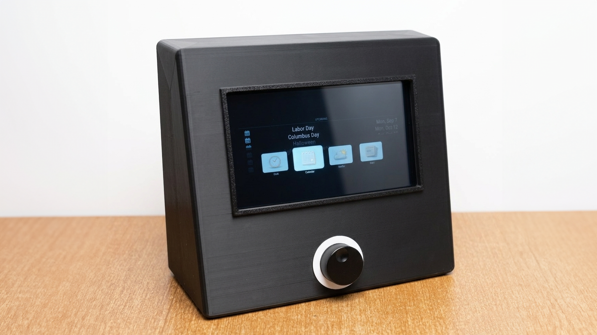
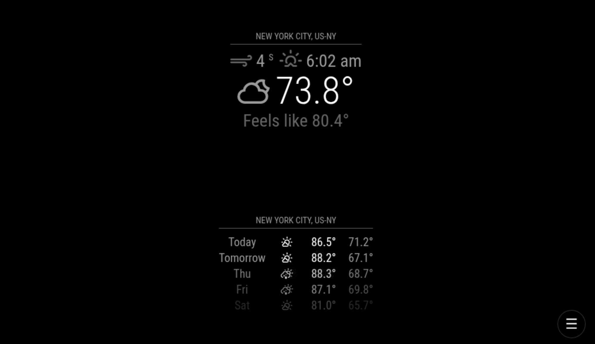
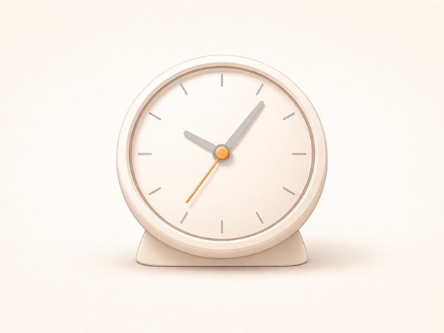
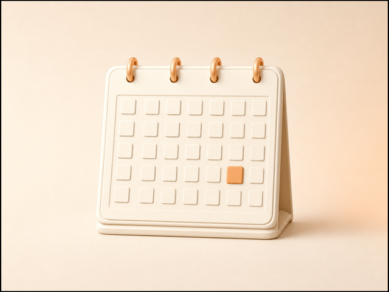

# MMM-Seymour

<p align="center">
  
</p>

Seymour reimagines the spirit of the 3Com Audrey internet appliance as a
modern, local-first ambient interface. Audrey was not merely a small computer:
it was a friendly, dedicated object that kept useful information close at hand.
Seymour carries that idea forward with glanceable channels, calm notifications,
deliberate tactile control, sound, and visible status through an optional
illuminated encoder ring.

The goal is not to build another dashboard or require people to assemble a new
software ecosystem around one piece of hardware. Seymour should feel like an
appliance when it is sitting in a room, while remaining adaptable enough to be
useful in a kitchen, office, bedroom, workshop, or shared family space.

## Why MagicMirror?

[MagicMirror²](https://magicmirror.builders/) already has a mature community
and a rich catalog of modules for clocks, calendars, weather, news, photos,
home automation, music, cameras, and much more. Those modules represent years
of useful work that should not need to be rebuilt for a new enclosure or input
device.

Seymour treats that ecosystem as its foundation. It adds an appliance-oriented
interaction layer that organizes ordinary MagicMirror modules into channels
and makes them approachable through touch, a keyboard, a rotary encoder,
remote control, or GPIO notifications. Modules remain independently useful;
Seymour supplies the navigation, ambient attention, and shared interaction
model that help them feel like parts of one product.

MMM-Seymour is the software component that provides the visual channel selector
for installations using
[MMM-pages](https://github.com/edward-shen/MMM-pages). Press Enter to open the
selector, use the left and right arrow keys to choose a channel, and press Enter
again to switch pages. Newer MMM-pages installations can set
`pageChangeNotification: "PAGE_SELECT"`; older installations may use
`PAGE_CHANGED`.

### Channel selection in action

Open the selector with the encoder, keyboard, or touch launcher; move between
the available channels; then deliberately confirm the destination. The active
MagicMirror channel remains visible behind the selector, preserving context
while keeping navigation brief and focused.

<p align="center">
  
</p>

**Project status:** working prototype and pre-release software. The module is
running on the physical Seymour appliance, but installation and compatibility
testing outside that reference system are still in progress.

### A channel built from stock modules

The Weather channel below combines two instances of MagicMirror's bundled
Weather module—current conditions and forecast—on one MMM-pages page. Seymour
provides the channel navigation and appliance frame; the weather content remains
ordinary MagicMirror configuration.

<p align="center">
  
</p>

### Strongly recommended: MMM-MessageCenter

Seymour works without a notification module, but
[MMM-MessageCenter](https://github.com/bwente/MMM-MessageCenter) is strongly
recommended for the full ambient-appliance experience.

It gives notifications from MagicMirror modules, Home Assistant, and other
local systems one consistent destination. Messages can appear immediately,
remain available in an inbox, and request attention without knowing how that
attention will be presented. Seymour can then translate semantic attention
events into a page change, an on-screen alert, or a WLED ring effect.

This separation keeps both projects useful on their own: MessageCenter does
not require Seymour, WLED, or Home Assistant, and Seymour does not require
MessageCenter. Together, they turn transient alerts into a calm, visible
notification system that feels much more like an appliance than a dashboard.

The public-safe [`examples/showcase.config.js`](examples/showcase.config.js)
demonstrates the recommended pairing without personal services or credentials.

## Documentation

- [Stock-module example](examples/stock-modules.config.js) — a small working
  configuration using modules bundled with MagicMirror.
- [Showcase example](examples/showcase.config.js) — the stock channels plus a
  public-safe MMM-MessageCenter inbox and the reference GPIO encoder mapping
  for demonstrations and screenshots.
- [WLED setup](docs/wled.md) — install the Seymour preset pack, configure the
  ring, test it, and understand state priority and fallbacks.
- [Recommended modules](docs/recommended-modules.md) — modules that fit the
  appliance experience, organized by role and dependency level.
- [Hardware integration](docs/hardware-integration.md) — encoder, GPIO, page,
  and semantic-notification contracts.
- [Channel artwork](docs/channel-art.md) — asset sizes, conventions, and a
  reusable prompt for custom themes.
- [Changelog](CHANGELOG.md) — features and behavior planned for the first
  public-preview release.

## Hardware

The module has no dedicated hardware dependencies. A typical installation uses:

- a Raspberry Pi or other computer capable of running MagicMirror²;
- a display supported by that computer; and
- a USB, Bluetooth, GPIO-to-keyboard, or remote-control device that emits the
  standard browser key events or Seymour GPIO notifications.

Bluetooth and wireless keyboards may introduce pairing or wake-from-sleep
behavior outside this module. GPIO buttons need a separate service or module to
translate button presses into keyboard events.

## Installation

From the MagicMirror `modules` directory:

```sh
git clone https://github.com/bwente/MMM-Seymour.git
```

No runtime package installation is required. Add the module to `config/config.js`
and ensure MMM-pages is installed and configured.

For a complete starting point made only from MagicMirror's bundled Clock,
Calendar, Weather, and News Feed modules, see
[`examples/stock-modules.config.js`](examples/stock-modules.config.js).

MMM-Seymour must also be listed in MMM-pages' `fixed` array so the selector
remains visible and available from every page:

```js
{
  module: "MMM-pages",
  config: {
    fixed: ["MMM-Seymour"],
    modules: [
      ["clock"],
      ["weather"],
      ["newsfeed"]
    ]
  }
}
```

## Configuration

```js
{
  module: "MMM-Seymour",
  position: "fullscreen_above",
  config: {
    theme: "dark",
    selectorSize: "medium",
    showLabels: true,
    enableKeyboard: true,
    enableTouch: true,
    showTouchLauncher: true,
    autoDismiss: true,
    autoDismissDelay: 4000,
    interaction: {
      enabled: true,
      doublePressDelay: 300,
      timeout: 10000,
      label: "CONTROL MODE"
    },
    wled: {
      enabled: false,
      baseUrl: "http://wled-seymour.local",
      heartbeatInterval: 60000,
      presets: {
        open: 1,
        idle: 2,
        attention: 3,
        timerWarning: 4,
        timerFinished: 5,
        control: 6
      }
    },
    channels: [
      { label: "Clock", page: 0, thumbnail: "clock.png" },
      { label: "Calendar", page: 1, thumbnail: "calendar.png" },
      { label: "Weather", page: 2, thumbnail: "weather.png" },
      { label: "News", page: 3, thumbnail: "news.png" }
    ]
  }
}
```

| Option | Type | Default | Description |
| --- | --- | --- | --- |
| `selectorSize` | string | `"medium"` | Thumbnail preset: `small`, `medium`, or `large`. |
| `theme` | string | `"default"` | Channel-art theme folder below `assets/themes`. Bundled themes: `default` and `dark`. |
| `showLabels` | boolean | `true` | Show the channel label below each image. |
| `enableKeyboard` | boolean | `true` | Register the global keyboard controls. |
| `enableTouch` | boolean | `true` | Enable touchscreen channel activation and tap-outside dismissal. |
| `showTouchLauncher` | boolean | `true` | Show a compact on-screen button that opens the channel selector. |
| `autoDismiss` | boolean | `false` | Close an open selector after inactivity. |
| `autoDismissDelay` | number | `5000` | Auto-dismiss delay in milliseconds. |
| `interaction` | object | Enabled | Double-press timing and inactivity timeout for interactive channels. |
| `remoteControl` | object | Enabled | Optional MMM-Remote-Control API registration. Set `enabled: false` to suppress it. |
| `selectorLifecycle` | object | `{ open: [], close: [] }` | Optional notification actions sent when the selector opens or closes. Actions accept `notification`, optional `payload`, and an optional `page` filter. |
| `wled` | object | Disabled | Optional WLED endpoint, heartbeat interval, and semantic preset mappings. New timer and control mappings are opt-in. |
| `channels` | array | `[]` | Ordered list of pages available in the selector. |

Each channel accepts `label`, a non-negative integer MMM-pages `page`, and a
`thumbnail` filename. Seymour resolves that filename inside the selected theme
folder. Missing thumbnail names use `placeholder.png`.

### Interactive channels

A channel can optionally expose hardware-independent notification mappings:

```js
{
  label: "Music",
  page: 2,
  thumbnail: "music.png",
  controls: {
    directRotateLeft: "MUSIC_VOLUME_DOWN",
    directRotateRight: "MUSIC_VOLUME_UP",
    rotateLeft: "MUSIC_CONTROL_LEFT",
    rotateRight: "MUSIC_CONTROL_RIGHT",
    press: "MUSIC_CONTROL_SELECT",
    exit: "MUSIC_CONTROL_BACK"
  }
}
```

With the selector closed, the optional `directRotateLeft` and
`directRotateRight` notifications provide immediate, reversible controls such as
volume. A single press retains Seymour's normal selector behavior. Two presses
within `interaction.doublePressDelay` enter the channel's interaction mode.
While that mode is active, rotation sends `rotateLeft` or `rotateRight`, and a
deliberate single press sends `press`. A second double press, a channel change,
or `interaction.timeout` exits and sends the optional `exit` notification.

This contract is not specific to music or GPIO. Any MagicMirror module can
participate by accepting the configured notifications and exposing a visible
focus state. While interaction mode is active, Seymour displays a blue viewport
outline and a pulsing status badge. The badge text is configurable with
`interaction.label`.

Modules that already expose ordinary keyboard-focusable HTML controls can use
Seymour's generic focus adapter without implementing notifications:

```js
{
  label: "Timer",
  page: 7,
  thumbnail: "timer.png",
  controls: {
    mode: "focus",
    selector: ".MMM-KitchenTimer button"
  }
}
```

In `focus` mode, double press enters control mode, rotation cycles through
visible matching elements, and a deliberate press activates the focused
element. The optional `selector` should scope focus to the active module. If it
is omitted, Seymour uses visible buttons, links, form controls, and elements
with a non-negative `tabindex`, excluding Seymour's own controls.

Themes are configuration-only. To switch the complete selector artwork without
changing the channel list, set:

```js
theme: "dark"
```

Custom themes can be added under `assets/themes/<name>` using the same filenames
as the configured channels. Keep artwork at a 4:3 aspect ratio; the bundled
themes use 640 x 480 PNG files.

#### Channel artwork preview

These tiles correspond to the Clock, Calendar, and Weather channels in the
stock configuration:

<p align="center">
  
  
  
</p>

Artwork should communicate a channel at a glance without including its label in
the image. Seymour renders the configured channel label separately. See
[`docs/channel-art.md`](docs/channel-art.md) for a reusable prompt and asset
requirements.

When WLED is enabled, Seymour immediately applies the current state and repeats
it every `heartbeatInterval` milliseconds. This restores the expected preset
after a WLED reboot or temporary network interruption. Set the interval to `0`
to disable the heartbeat while retaining event-driven LED updates. Optional
states fall back safely: timer completion uses `attention`, while timer warning
and control mode use `idle` when their mappings are not configured.

Preset selection follows appliance priority rather than module ownership:
selector open, timer finished, attention, timer warning, control mode, then
idle. KitchenTimer, MessageCenter, and interactive channel modules remain
independent of WLED addresses and preset numbers. See [WLED setup](docs/wled.md)
for the upload-ready preset pack and complete configuration.

MMM-Seymour listens for MMM-pages' `NEW_PAGE` notification and highlights the
currently visible page whenever the selector opens.

## MMM-Remote-Control

When [MMM-Remote-Control](https://github.com/Jopyth/MMM-Remote-Control) is
installed, Seymour automatically registers a `seymour` API with actions to open
and close the selector, move through channels, activate the selection, and
select a configured channel by page number. No Remote Control dependency is
required; MagicMirror simply ignores the registration notification when the
module is absent.

Keep Seymour and Remote Control available on every MMM-pages page:

```js
fixed: ["MMM-Seymour", "MMM-Remote-Control"]
```

Seymour also makes MMM-Remote-Control's visual color-temperature overlay
input-transparent. Brightness and color-temperature effects continue to work,
while touchscreen events reach the active page and Seymour launcher.

The registered endpoints appear in MMM-Remote-Control's generated API
documentation at `/api/docs`. Direct page selection uses
`POST /api/module/seymour/select` with a JSON body such as `{ "page": 2 }`.
Protect Remote Control with its `apiKey` option before exposing the API beyond a
trusted local network.

## Hardware project

Enclosure, wiring, WLED, CAD, fabrication, and assembly work is maintained in
the companion Seymour-Hardware project. That repository is still private while
the prototype files and assembly documentation are being prepared. See
[Hardware integration](docs/hardware-integration.md) for the shared control and
software contract available here.

## Controls

| Key | Action |
| --- | --- |
| Enter | Open the selector or activate the selected page. |
| Left / Right | Move through channels while the selector is open. |
| Escape | Close the selector without changing pages. |

Touching the launcher opens the same selector used by the encoder. Touch a
channel to activate it immediately, or touch the darkened area outside the
selector to close it without changing pages.

Modules that render outside the browser, such as a native video player, can
temporarily yield while the selector is visible:

```js
selectorLifecycle: {
  open: [
    { page: 6, notification: "RTSP-STOP", payload: "all" }
  ],
  close: [
    { page: 6, notification: "RTSP-PLAY", payload: "all" }
  ]
}
```

Seymour also broadcasts `SEYMOUR_SELECTOR_OPENED` and
`SEYMOUR_SELECTOR_CLOSED` with the current page so other modules can integrate
without being named in Seymour.

Encoder navigation keeps the active channel centered as the strip grows beyond
the available display width. The strip remains directly swipeable by touch.

Keyboard shortcuts are ignored while typing in input, select, textarea, or
content-editable elements.

The equivalent MagicMirror notifications are `SEYMOUR_PRESS`,
`SEYMOUR_ROTATE_LEFT`, and `SEYMOUR_ROTATE_RIGHT`. On an interactive channel,
double `SEYMOUR_PRESS` enters or exits module control while a single press keeps
the channel-selector behavior described above. `ATTENTION_ON` and
`ATTENTION_OFF` select or clear the configured WLED attention state.

Attention is tracked by the sending MagicMirror module. One module clearing its
attention does not turn off the ring while another module still requires it.

## Development

Run the dependency-free unit tests with Node.js 18 or newer:

```sh
npm test
```

The browser integration should also be tested in the same MagicMirror² and
MMM-pages versions used by the target mirror.

### Compatibility policy

MMM-Seymour has no runtime npm dependencies. It is intended to follow the
currently supported MagicMirror² release and the current MMM-pages release.
Because both projects evolve independently, each Seymour release should record
the versions used for its appliance test in the release notes. Older versions
may work, but are not assumed unless they have been tested explicitly.

## Release checklist

- Test keyboard input and page changes on the target hardware.
- Validate the stock configuration against the supported MagicMirror and
  MMM-pages releases.
- Verify optional WLED behavior with the controller temporarily unavailable and
  after it reconnects.
- Confirm that personal `config.js`, credentials, hostnames, and calendar URLs
  are not included in the repository or its history.
- Clone the release into a clean MagicMirror installation and complete setup
  using only the published documentation.
- Record the tested MagicMirror², MMM-pages, Node.js, and Raspberry Pi OS
  versions in the release notes.

## Acknowledgements

Seymour is possible because MagicMirror modules can be combined instead of
rewritten. Particular thanks go to:

- the [MagicMirror²](https://github.com/MagicMirrorOrg/MagicMirror) maintainers
  and module community;
- Edward Shen for [MMM-pages](https://github.com/edward-shen/MMM-pages), which
  provides Seymour's underlying page model;
- Tom Hirschberger for
  [MMM-GPIO-Notifications](https://github.com/Tom-Hirschberger/MMM-GPIO-Notifications),
  including rotary-encoder support;
- Jopyth and contributors for
  [MMM-Remote-Control](https://github.com/Jopyth/MMM-Remote-Control);
- shbatm for [MMM-KeyBindings](https://github.com/shbatm/MMM-KeyBindings) and
  [MMM-RTSPStream](https://github.com/shbatm/MMM-RTSPStream); and
- MMRIZE for
  [MMM-CalendarExt3](https://github.com/MMRIZE/MMM-CalendarExt3) and
  [MMM-CalendarExt3Agenda](https://github.com/MMRIZE/MMM-CalendarExt3Agenda).

The reference appliance also benefits from WLED, Music Assistant, Squeezelite,
Raspberry Pi, and the wider open-source community. Seymour's original code and
integration work sit on top of that generous foundation.

## License

MMM-Seymour is available under the [MIT License](LICENSE). Bundled channel
artwork is distributed under the same license; see [ASSETS.md](ASSETS.md) for
provenance details.
